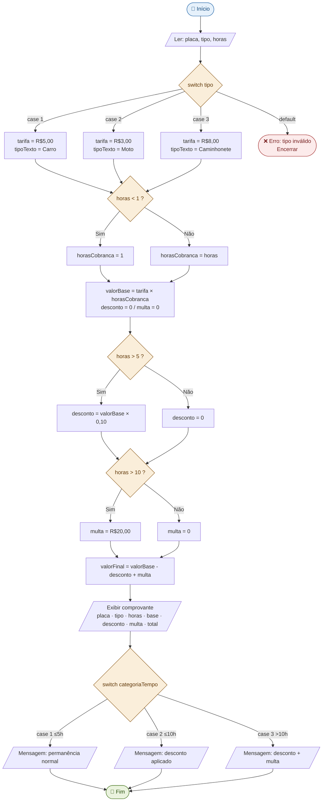

# 🅿️ Sistema de Gerenciamento de Estacionamento Rotativo em C

Este projeto implementa um sistema de estacionamento rotativo em linguagem C, cobrindo variáveis, entrada/saída, operadores e estruturas condicionais (if/else e switch-case). O programa calcula o valor a pagar com base no tipo de veículo e no tempo de permanência, aplicando descontos e multas conforme as regras de negócio.

---

## 🚀 Funcionalidades

- 🚗 Identificação do veículo por placa e tipo (Carro, Moto, Caminhonete)
- 💰 Cálculo de tarifa por hora conforme o tipo de veículo
- ⏱️ Cobrança mínima de 1 hora para permanências curtas
- 🏷️ Desconto automático de 10% para permanências acima de 5 horas
- 🚨 Multa adicional de R$ 20,00 para permanências acima de 10 horas
- 🧾 Emissão de comprovante detalhado com todos os valores
- ✅ Uso correto de `switch-case` para seleção de tipo de veículo e categoria de permanência
- 🛡️ Validação de tipo de veículo com tratamento de entrada inválida

---

## 🧱 Estrutura do Projeto

```
atividade-estacionamentoEC/
│
├── main.c        # Código-fonte principal do sistema
└── README.md     # Documentação e modelagem do projeto
```

---

## 💻 Como Executar

1. Clone o repositório:
    ```bash
    git clone https://github.com/seuusuario/seurepositorio.git
    cd atividade-estacionamentoEC
    ```

2. Compile o programa com GCC:
    ```bash
    # Linux / macOS
    gcc -o estacionamento main.c

    # Windows (MinGW)
    gcc -o estacionamento.exe main.c
    ```

3. Execute o programa:
    ```bash
    # Linux / macOS
    ./estacionamento

    # Windows
    estacionamento.exe
    ```

4. Informe os dados solicitados:
    ```
    Informe a placa do veiculo: ABC1234
    Selecione o tipo do veiculo:
      1 - Carro
      2 - Moto
      3 - Caminhonete
    Opcao: 1
    Informe o tempo de permanencia (em horas): 3
    ```

---

## 🧪 Requisitos

- GCC (GNU Compiler Collection) ou qualquer compilador C compatível com C99
- Linux, macOS ou Windows (com MinGW ou WSL)

---

## 📄 Modelagem

### Análise do Problema

Um estacionamento rotativo cobra pelo tempo de uso da vaga. O sistema simula o caixa de saída: recebe a placa, o tipo de veículo e o tempo de permanência, e calcula o valor final com descontos ou multas aplicáveis.

**Decisões que o sistema toma:**

| Decisão | Estrutura usada |
|---|---|
| Qual tarifa aplicar conforme o tipo de veículo? | `switch-case` |
| O tempo é menor que 1 hora? Cobrar mínimo de 1 hora. | `if/else` |
| O tempo é maior que 5 horas? Aplicar desconto de 10%. | `if` |
| O tempo é maior que 10 horas? Aplicar multa de R$ 20,00. | `if` |
| Exibir mensagem contextual conforme faixa de permanência. | `switch-case` |

---

### Definição das Variáveis

| Nome | Tipo | Finalidade |
|---|---|---|
| `placa` | `char[9]` | Placa do veículo (até 8 caracteres + `\0`) |
| `tipo` | `int` | Código do tipo de veículo: 1=Carro, 2=Moto, 3=Caminhonete |
| `horas` | `float` | Tempo de permanência em horas |
| `tarifa` | `float` | Preço por hora conforme o tipo de veículo |
| `horasCobranca` | `float` | Horas efetivamente cobradas (mínimo de 1 hora) |
| `valorBase` | `float` | Resultado de `tarifa × horasCobranca` |
| `desconto` | `float` | Valor do desconto (10% se `horas > 5`) |
| `multa` | `float` | Multa adicional (R$ 20,00 se `horas > 10`) |
| `valorFinal` | `float` | Valor final: `valorBase - desconto + multa` |
| `tipoTexto` | `char[15]` | Nome textual do tipo de veículo para exibição |
| `categoriaTempo` | `int` | Categoria de permanência: 1=curta, 2=longa, 3=muito longa |

---

### Regras de Negócio

**Tarifas por tipo de veículo:**

| Código | Veículo | Tarifa |
|---|---|---|
| 1 | Carro | R$ 5,00 / hora |
| 2 | Moto | R$ 3,00 / hora |
| 3 | Caminhonete | R$ 8,00 / hora |

**Regras adicionais:**

| Condição | Ação |
|---|---|
| `horas < 1` | Cobrar valor mínimo (1 hora cheia) |
| `horas > 5` | Aplicar desconto de 10% sobre o valor base |
| `horas > 10` | Adicionar multa de R$ 20,00 (cumulativa com o desconto) |

**Fórmula de cálculo:**

```
horasCobranca = MAX(horas, 1)
valorBase     = tarifa × horasCobranca
desconto      = (horas > 5)  ? valorBase × 0,10 : 0
multa         = (horas > 10) ? 20,00 : 0
valorFinal    = valorBase - desconto + multa
```

---

### Fluxograma do Processamento



---

## 🧪 Exemplos de Entrada e Saída

### Exemplo 1 — Carro, 3 horas (sem desconto, sem multa)

**Entrada:**
```
ABC1234
1
3
```

**Saída:**
```
============================================
             COMPROVANTE DE SAIDA
============================================
Placa            : ABC1234
Tipo de veiculo  : Carro
Tarifa por hora  : R$ 5.00
Tempo registrado : 3.00 h
Horas cobradas   : 3.00 h
--------------------------------------------
Valor base       : R$ 15.00
Desconto         : Nao aplicavel
Multa            : Nao aplicavel
--------------------------------------------
VALOR FINAL      : R$ 15.00
============================================
Observacao: Permanencia normal. Obrigado pela preferencia!
```

### Exemplo 2 — Moto, 0,5 hora (cobra mínimo de 1 hora)

**Entrada:**
```
XYZ9988
2
0.5
```

**Saída:**
```
============================================
             COMPROVANTE DE SAIDA
============================================
Placa            : XYZ9988
Tipo de veiculo  : Moto
Tarifa por hora  : R$ 3.00
Tempo registrado : 0.50 h
Horas cobradas   : 1.00 h
--------------------------------------------
Valor base       : R$ 3.00
Desconto         : Nao aplicavel
Multa            : Nao aplicavel
--------------------------------------------
VALOR FINAL      : R$ 3.00
============================================
Observacao: Permanencia normal. Obrigado pela preferencia!
```

### Exemplo 3 — Caminhonete, 7 horas (desconto de 10%)

**Entrada:**
```
DEF5678
3
7
```

**Saída:**
```
============================================
             COMPROVANTE DE SAIDA
============================================
Placa            : DEF5678
Tipo de veiculo  : Camionete
Tarifa por hora  : R$ 8.00
Tempo registrado : 7.00 h
Horas cobradas   : 7.00 h
--------------------------------------------
Valor base       : R$ 56.00
Desconto (10%)   : -R$ 5.60
Multa            : Nao aplicavel
--------------------------------------------
VALOR FINAL      : R$ 50.40
============================================
Observacao: Permanencia longa. Desconto de 10% aplicado!
```

### Exemplo 4 — Carro, 12 horas (desconto + multa)

**Entrada:**
```
GHI4321
1
12
```

**Saída:**
```
============================================
             COMPROVANTE DE SAIDA
============================================
Placa            : GHI4321
Tipo de veiculo  : Carro
Tarifa por hora  : R$ 5.00
Tempo registrado : 12.00 h
Horas cobradas   : 12.00 h
--------------------------------------------
Valor base       : R$ 60.00
Desconto (10%)   : -R$ 6.00
Multa (>10h)     : +R$ 20.00
--------------------------------------------
VALOR FINAL      : R$ 74.00
============================================
Observacao: Permanencia superior a 10h. Desconto + multa aplicados.
```

---

## 📄 Licença

Projeto acadêmico desenvolvido para a disciplina de Laboratório de Programação — Engenharia da Computação, UFMA. Prof. Rondineli Seba Salomão. Uso livre para fins educacionais.
